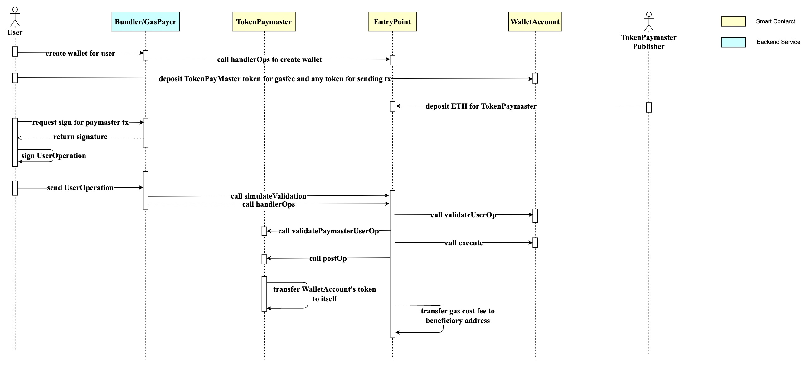

# AA Wallet Solidity

AA Wallet Solidity is an Ethereum-based smart contract for account abstraction wallets, enabling users to interact with transactions and contracts in ways that differ from traditional Ethereum addresses.

## Dependencies

- Node.js: v16.x or higher

## Setup and Configuration

### Installation

Run the following command in the root directory to install the necessary npm packages:

```shell
npm install
```

### Environment Configuration

1. Copy the example environment file:

    ```shell
    cp .env.example .env
    ```

2. Modify the environment variables in the `.env` file:

    ```plaintext
    # Replace with your actual Etherscan API key
    SCAN_API_KEY=ABC123ABC123ABC123ABC123ABC123ABC1
    # Replace with your Ethereum address private key
    PRIVATE_KEY=0xabc123abc123abc123abc123abc123abc123abc123abc123abc123abc123abc1
    ```

## Testing

Execute the following commands to run different tests:

1. Entry point test:

    ```shell
    npm run entry-test
    ```

## Deployment

Deploy the ERC4337 component to various networks using the commands below:

### Polygon Network

Deploy to Polygon:

```shell
npm run deploy-polygon
```

### Mumbai Test Network

Deploy to Mumbai Testnet:

```shell
npm run deploy-mumbai
```

## Contract Address

You can find the deployed contract addresses [here](https://z4kqs8pky3.feishu.cn/docx/JSgtdpFffoTlKcxldTzcFjNSnOc).

## ERC4337 Overview



For the source code, please visit the [GitHub repository](https://github.com/eth-infinitism/account-abstraction).